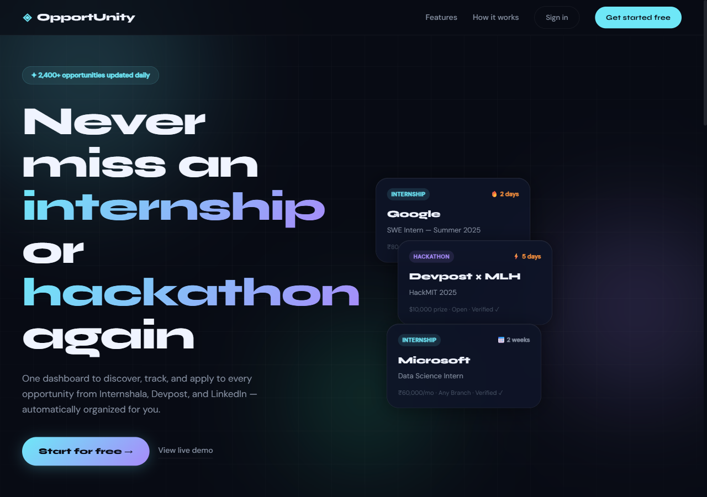

# OpportUnityHub Smart Opportunity Tracker

FastAPI-based opportunity tracker for students and developers, combining Gmail sync, opportunity scraping, authenticated workflows, and local/Supabase-backed storage.

## What It Does

OpportUnityHub helps track internships, jobs, hackathons, and career opportunities from multiple sources:

- Gmail opportunity emails
- Internshala
- Devpost
- Unstop
- Remotive
- Saved/applied status workflows

The project is designed as a portfolio-grade backend/product system, with demo-mode paths for local testing and real OAuth/Supabase paths for deeper setup.

## Screenshot

Captured from the static frontend landing page. Full dashboard runtime and authenticated flows still need backend verification.



## Features

- FastAPI backend.
- Static responsive frontend.
- JWT authentication and per-user opportunity records.
- Google OAuth/Gmail sync flow.
- Rule-based and AI-assisted email classification path.
- Scrapers for multiple opportunity sources.
- Supabase-backed storage with local fallback.
- Saved/applied/deleted status workflows.
- Render/Vercel deployment configuration.

## Important Maturity Note

This is not yet a production-hardened system.

Known limitations:

- Demo-mode paths exist for local testing.
- CORS is broad and should be restricted before production use.
- Secret values must be supplied through environment variables.
- Default development secrets must be replaced.
- Gmail OAuth setup must be configured carefully for each deployment URL.

## Tech Stack

- Python
- FastAPI
- Uvicorn
- Pydantic
- Google OAuth / Gmail API
- Supabase or local persistence
- BeautifulSoup / requests / httpx
- Vanilla HTML/CSS/JavaScript

## Local Setup

```bash
python -m venv venv
venv\Scripts\activate
pip install -r backend/requirements.txt
copy .env.example .env
python -m uvicorn backend.main:app --reload --port 8000
```

Then open:

```text
http://localhost:8000/index.html
http://localhost:8000/email-sync.html
```

## Environment Variables

Use `.env.example` as the source of truth.

Core variables:

- `SUPABASE_URL`
- `SUPABASE_KEY`
- `GOOGLE_CLIENT_ID`
- `GOOGLE_CLIENT_SECRET`
- `GOOGLE_REDIRECT_URI`
- `GEMINI_API_KEY` or `OPENAI_API_KEY`
- `JWT_SECRET`
- `TOKEN_ENCRYPTION_KEY`

## Verification Status

Verified locally:

- Python syntax compile passed for backend modules and test/debug scripts.
- Fresh public clone dependency install passed with `pip install -r backend/requirements.txt`.
- `pip check` reported no broken requirements.
- FastAPI runtime boot passed with `python -m uvicorn backend.main:app`.
- `/api/health` returned status `ok` in local fallback mode.
- Static frontend serving passed for `/index.html`.
- Protected opportunity routes correctly return `401` without a bearer token.
- Local fallback auth smoke test passed: registering a disposable test user returned a token, `/api/auth/me` returned that user, and `/api/opportunities/stats` returned an empty dashboard state.

Not yet verified:

- Gmail OAuth flow.
- Scraper reliability.
- Supabase deployment path.

## Cleanup Needed

- Restrict CORS before production deployment.
- Replace default development secrets in any real deployment.
- Pin or lock dependency versions for more reproducible setup.
- Add an automated smoke test for health, static frontend serving, and local fallback auth.

## Resume Angle

Built a FastAPI opportunity tracker that syncs Gmail, scrapes opportunity portals, filters non-opportunity messages, and stores internships, hackathons, and jobs behind authenticated user workflows.
